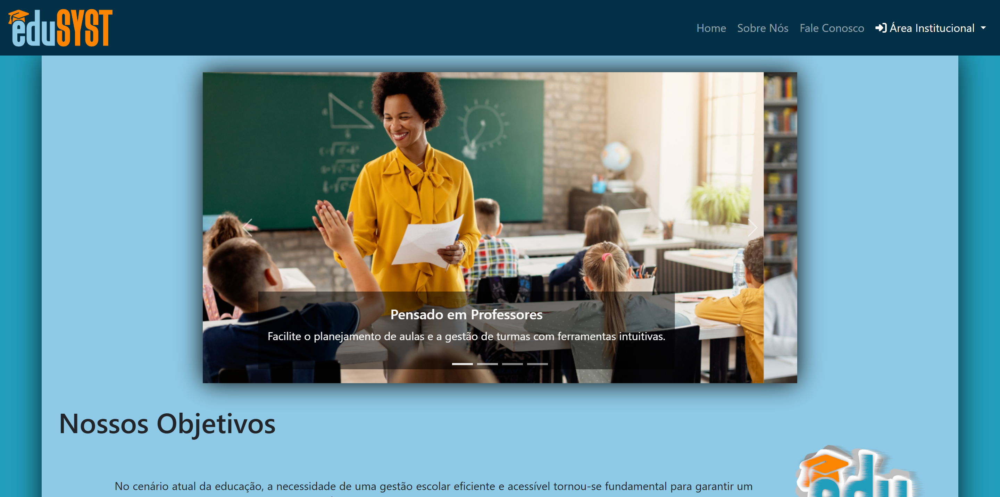
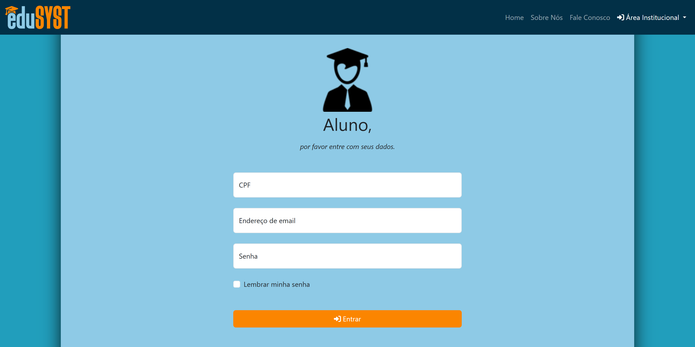
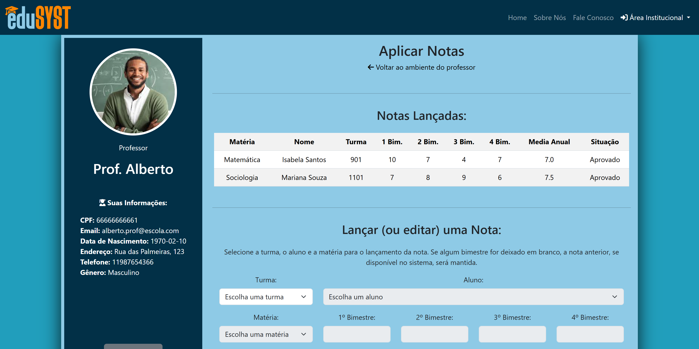
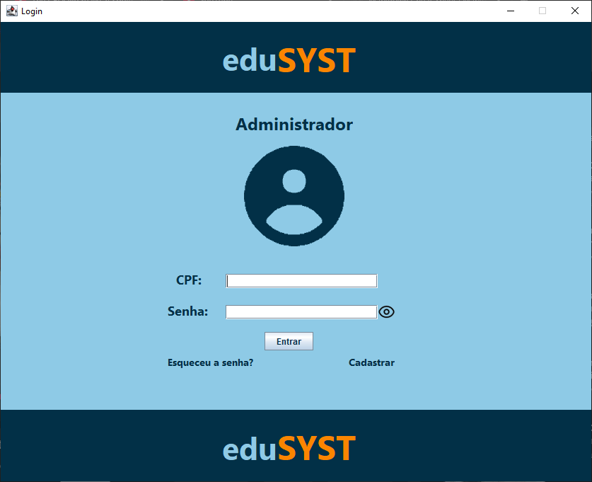
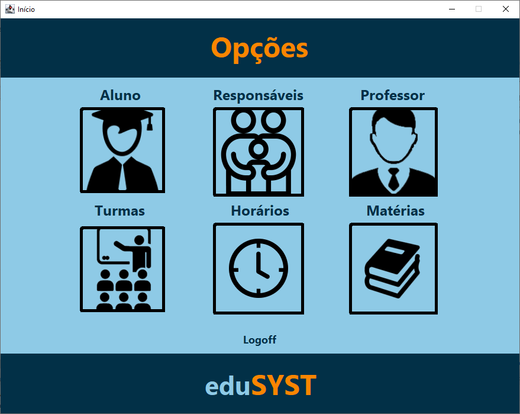
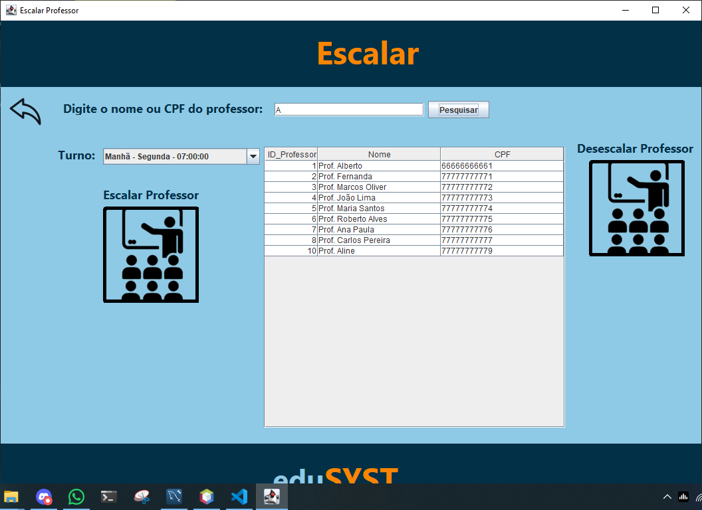
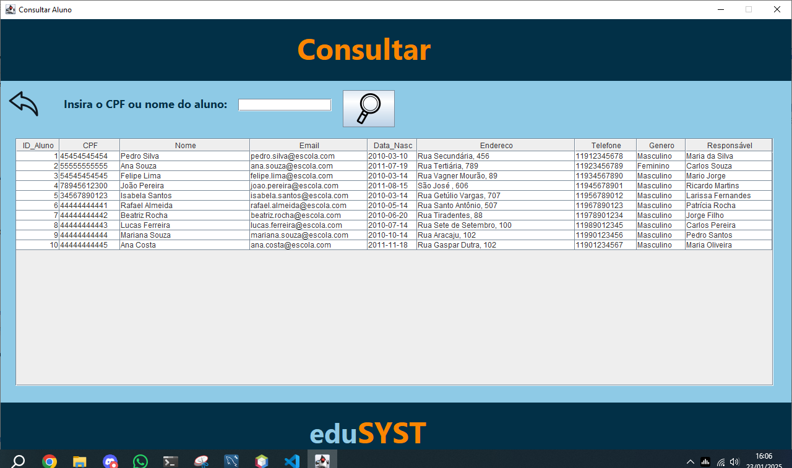
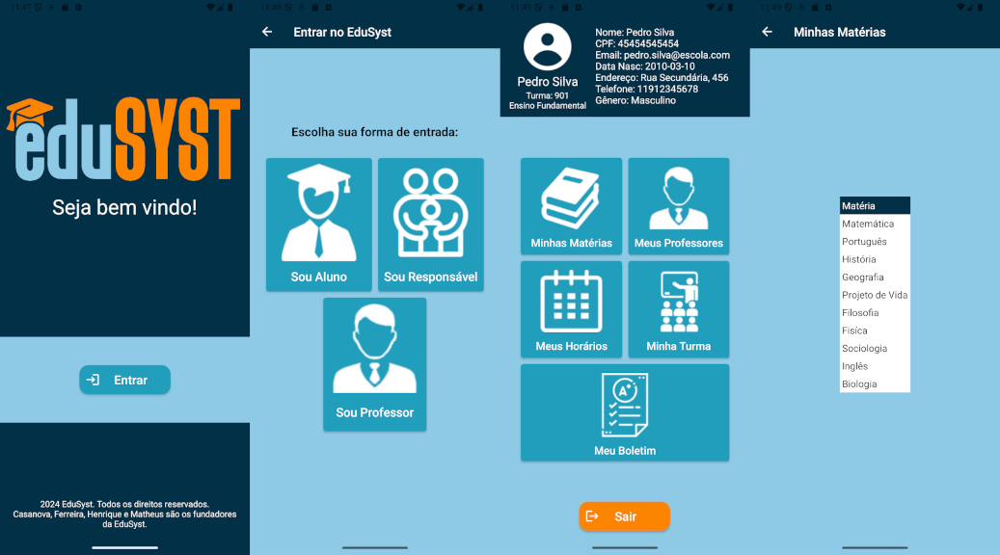

    <b>Trabalho de Conclusão de Curso apresentado ao Instituto Superior de Educação do Rio de Janeiro - ISERJ/FAETEC como parte dos requisitos para a obtenção do título de Técnico em Informática.</b>

<!-- PROJECT LOGO -->
 

  

  <h3 align="center">EduSyst</h3>

  

    📚 Sistema de Gestão Escolar Multiplataforma
     
    <a href="https://drive.google.com/open?id=12UIDfrynj5Vg_2uMZ0yGxDLYsnEQFWQT&usp=drive_fs"><strong>Explorar a Documentação »</strong></a>
    <!--·
    <a href="https://github.com/othneildrew/Best-README-Template/issues/new?labels=enhancement&template=feature-request---.md">Request Feature</a>-->
  

## Sobre o Projeto / About This Project
EduSyst é um sistema de informações estudantis (SIS) projetado para modernizar e otimizar a administração escolar de escolas públicas na cidade do Rio de Janeiro, Brasil. O sistema conecta alunos, pais, professores e administradores por meio de uma plataforma digital unificada, aprimorando a comunicação e a organização. O EduSyst é composto por três aplicativos interconectados, cada um adaptado às necessidades dos diferentes usuários e alimentado por um banco de dados MySQL centralizado.

- O **Aplicativo Desktop EduSyst**, desenvolvido com Java SE, Swing e a API JDBC, foi projetado para administradores escolares. Ele gerencia cadastros de alunos e professores, organização de cursos, cronogramas e geração de relatórios, garantindo operações institucionais eficientes.
- O **Aplicativo Web EduSyst**, desenvolvido com Java Server Pages (JSP), HTML, CSS, Bootstrap e JavaScript, atende a alunos, professores e pais. Os professores podem gerenciar notas, históricos escolares e avaliações dos alunos, além de se comunicarem com os estudantes por meio de um sistema de chat de classe. Pais e alunos têm acesso a horários de aula, tarefas e informações dos professores.
- O **Aplicativo Mobile EduSyst**, construído com Android Studio (Java) e PHP para conectividade MySQL, oferece uma experiência nativa no Android. Ele fornece aos alunos, professores e pais as mesmas funcionalidades essenciais do aplicativo web, garantindo acessibilidade em qualquer lugar.

EduSyst is a student information system (SIS) designed to modernize and streamline school administration in the public schools of Rio de Janeiro, Brazil. The system connects students, parents, teachers, and administrators through a unified digital platform, enhancing communication and organization. EduSyst consists of three interconnected applications, each tailored to different user needs and powered by a centralized MySQL database.

- The **EduSyst Desktop App**, built with Java SE, Swing, and the JDBC API, is designed for school administrators. It handles student and teacher registrations, course management, scheduling, and report generation, ensuring smooth institutional operations.
- The **EduSyst Web App**, developed using Java Server Pages (JSP), HTML, CSS, Bootstrap, and JavaScript, serves students, teachers, and parents. Teachers can manage grades, transcripts, and student assessments while also communicating with students through a class chat system. Parents and students can access class schedules, assignments, and teacher information.
- The **EduSyst Mobile App**, built with Android Studio (Java) and PHP for MySQL connectivity, offers a native mobile experience. It provides students, teachers, and parents with the same essential functionalities as the web app, ensuring accessibility on the go.

## Screenshots
### Web

  
  
  
  

### Desktop

  
  
  
  

### Android

  

## Tech stack:

## Créditos
* **Gabriel Casanova** - Líder do projeto, desenvolvedor do ambiente web, aplicativo android e banco de dados
* **Matheus Menezes** - Desenvolvedor do ambiente desktop
* **Gabriel Ferreira** - Desenvolvedor do banco de dados
* **Gabriel Henrique** - Documentação
* **Prof. Dr. Vinicius Claro** - Orientação do TCC
